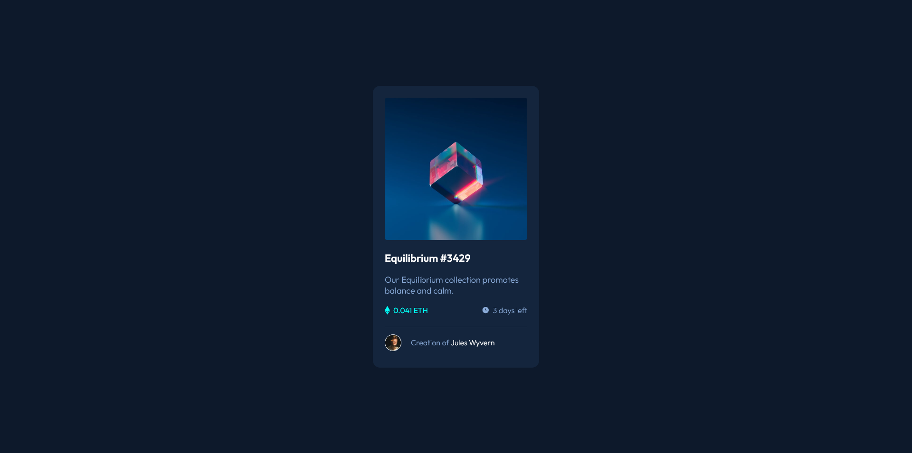

# Frontend Mentor - NFT preview card component solution

This is a solution to the [NFT preview card component challenge on Frontend Mentor](https://www.frontendmentor.io/challenges/nft-preview-card-component-SbdUL_w0U). Frontend Mentor challenges help you improve your coding skills by building realistic projects.

## Table of contents

- [Overview](#overview)
  - [The challenge](#the-challenge)
  - [Screenshot](#screenshot)
  - [Links](#links)
- [My process](#my-process)
  - [Built with](#built-with)
  - [What I learned](#what-i-learned)
  - [Continued development](#continued-development)
- [Author](#author)

## Overview

### The challenge

Build the Card Component per the Mockup

### Screenshot

### Links

- [Solution URL](https://danrichdan.github.io/nft-card-component/)
- [Portfolio](https://danriches.com)

## My process

Figure out the basic structure and then build from the outside in, thinking responsively.

### Built with

- HTML5 markup
- CSS
- Flexbox

### What I learned

I relearned how great flexbox is for positioning elements that are lined up and nicely spaced. I also learned how to speed up as I had limited time to do this.

### Continued development

I'd like to get better at determining what would be an id versus a class, using utility classes, and then not repeating styles.

## Author

- Website - [Dan Riches](https://www.danriches.com)
- Frontend Mentor - [@danrichdan](https://www.frontendmentor.io/profile/danrichdan)
